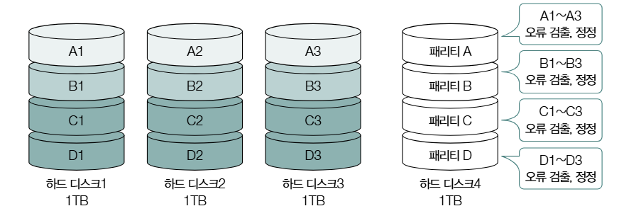
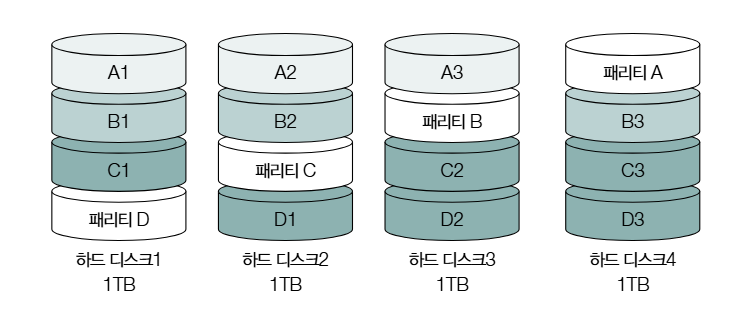
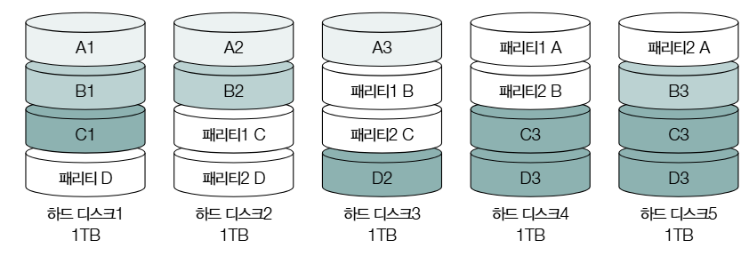

### 컴퓨터의 핵심 부품
1. CPU
2. 메모리, 캐시 메모리
3. 보조 기억 장치
4. 입출력 장치
5. 메인 보드와 버스

#### CPU
1. 산술 논리 연산 장치
- 사칙 연산, 논리 연산 등을 수행할 회로로 구성되어 있는 계산기.
2. 제어 장치
- 명렁어 해석 후 제어 신호라는 전기 신호를 내보내는 장치
3. 레지스터
- CPU 내부의 작은 임시 저장장치로, 데이터와 명령어를 처리하는 과정의 중간값을 저장

#### 명령어 사이클
명령어를 처리하는 과정에서 프로그램 속 각각의 명령어들은 일정한 주기를 반복하면서 실행함. 이 주기를 `명령어 사이클`이라고 함.

1. 인출 사이클
- 메모리에 있는 명령어를 CPU로 가지고 오는 단계
2. 실행 사이클
- CPU로 가져온 명령어를 실행하는 단계
3. 간접 사이클
- 명령어를 실행하기 위해 한 번 더 메모리에 접근하는 단계
4. 인터럽트 사이클

### CPU

#### 레지스터 종류
1. 프로그램 카운터
- 메모리에서 다음으로 읽어 들일 명령어의 주소를 저장.
- 항상 증가 하는 것은 아님.
2. 명렁어 레지스터
- 메모리에서 읽어 들인 명령어를 저장하는 레지스터
3. 범용 레지스터
- 일반적으로 사용할 수 있는 레지스터
4. 플래그 레지스터
- CPU 상태에 대한 부가 정보인 플래그(flag) 값을 저장하는 레지스터
- 부호, 제로, 캐리, 오버플로우, 인터럽트, 슈퍼바이즈 플래그가 있다.
5. 스택 포인터
- 메모리 내 스택 영역의 최상단 스택 데이터의 위치를 가리키는 레지스터

### 인터럽트
1. 동기 인터럽트
 - CPU에 의해 발생하는 인터럽트 (에외적인 상황에 발생)
2. 비동기 인터럽트 (하드웨어 인터럽트)
 - 입출력장치에 의해 발생하는 인터럽트

##### CPU의 하드웨어 인터럽트 처리 순서
1. 입출력장치는 CPU에게 인터럽트 요청 신호를 보낸다.
2. CPU는 실행 사이클이 끝나고 명령어를 인출하기 전에 항상 인터럽트 여부를 확인.
3. CPU는 인터럽트 요청을 확인하고, 인터럽트 플래그를 통해 현재 인터럽트를 받아들일 수 있는지 여부 확인
4. 인터럽트를 받아들일 수 있다면 CPU가 현재까지 작업 백업
5. CPU는 인터럽트 벡터를 참조하여 인터럽트 서비스 루틴을 실행
6. 인터럽트 서비스 루틴 실행이 끝나면 작업을 복구하여 실행을 재개

##### 인터럽트 서비스 루틴 (인터럽트 핸들러)
- 인터럽트를 처리하기 위한 프로그램
- 인터럽트가 발생했을 때 해당 인터럽트를 어떻게 처리하고 작동해야 할지에 대한 정보

##### 인터럽트 벡터
- 인터럽트 서비스 루틴을 식별하기 위한 정보

##### CPU가 인터럽트를 처리한다는 것은?
- 인터럽트 서비스 루틴을 실행하고 본래 작업으로 다시 돌아오는 것
- 인터럽트 서비스 루틴의 시작 주소를 알아야하며, 이는 `인터럽트 벡터`를 통해 알 수 있음.

#### CPU 성능 향상 기법
1. CPU 클럭 속도 향상
 - 필요 이상으로 높이면 발열이 높아짐
2. 멀티코어와 멀티스레드
 - 코어
  - CPU 내에서 명령을 읽어 들이고, 해석하고, 실행하는 부품
 - 스레드 (논리 프로세서)
  - 하나의 코어가 동시에 처리하는 명령어의 단위 

#### 하드웨어 스레드와 소프트웨어 스레드의 차이
- 하드웨어 스레드는 병렬성 (물리적 실행 단위)
- 소프트웨어 스레드는 동시성 (논리적 실행 단위)

#### CISC, RISC 차이
- CISC
 - 다채로운 기능을 지원하는 복잡한 명령어들로 이루어짐
 - 명령어의 기능이 복잡하고, 다양한 기능을 제공하기에 시간이 일정하지 않고, 실행에 따라 여러 클럭 주기가 필요함.
- RISC
 - 활용 가능한 명령어의 개수가 적음
 - 크기가 규격화 되어있음.
 - 하나의 명령어가 1클럭 내외로 실행됨.

### 파이프라이닝
- 명령어를 동시에 여러 단계로 나누어 처리

#### 파이프라인 위험
1. 데이터 위험
 - 데이터 의존성에 의해 발생함.
2. 제어 위험
 - 프로그램 카운터의 갑작스러운 변화에 의해 발생함.
3. 구조적 위험
 - 서로 다른 명령어가 동시에 ALU, 레지스터 등 같은 CPU 부품을 사용하려고 할 때 발생.

### 메모리
- 휘발성 저장장치임

#### DRAM
- 시간이 지나면 저장된 데이터가 점차 사라지는 RAM

#### SRAM
- Static RAM으로, 시간이 지나도 저장된 데이터가 사라지지 않음.
- 전원 공급이 이루이지지 않으면 내용은 소실됨.

#### SDRAM
- 클럭 신호와 동기화 된 발전된 형태의 DRAM

#### DDR SDRAM
- 대역폭을 넓혀 속도를 빠르게 만든 SDRAM

#### 캐시 메모리
- CPU의 연산 속도와 메모리 접근 속도의 차이를 줄이기 위한 저장장치
- L1, L2, L3 캐시가 있으며 L1, L2 캐시는 메모리 내부에, L3 캐시는 코어 외부에 있음.

### 보조기억장치와 입출력장치

#### RAID
- 하드 디스크 드라이브 (HDD)
- 플래시 메모리 기반 저장장치 (SSD)

#### RAID0
- 데이터를 여러 보조기억장치에 단순하게 나누어 저장하는 방식
- 스트라이핑 저장 방식 사용
- 저장된 정보가 안전하지 않음

#### RAID1
- 복구가 간단하고 안정성이 높음
- 사용량이 작아짐.

#### RAID4
- 페리티 정보를 저장하는 디스크를 따로 구성함
- 병목현상이 발생할 수 있음

#### RAID5
- 페리티 정보를 분산하여 저장하는 방식

#### RAID6
- RAID5와 같지만, 서로 다른 2개의 페리티를 두는 구성 방식
- RAID5에 비해 쓰기 속도는 일반적으로 느림

#### 입출력 기법

##### 장치 드라이버
- 장치 컨트롤러의 동작을 알고, 컨트롤러가 컴퓨터 내부와 정보를 주고받을 수 있도록 하는 프로그램

##### 프로그램 입출력
- 프로그램 속 명령어로 입출력 작업을 수행하는 방법

##### 인터럽트 기반 입출력 (다중 인터럽트)
다중 인터럽트란, **한 인터럽트를 처리하는 도중에 또 다른 인터럽트가 발생하는 경우**를 말합니다.

### 1. **인터럽트 우선순위(Priority) 방식**
* 각 인터럽트에 \*\*우선순위(priority)\*\*를 지정하여 처리 순서를 결정
* 더 높은 우선순위의 인터럽트가 발생하면 현재 인터럽트를 **일시 중단**하고 새로운 인터럽트를 처리함

### 2. **인터럽트 마스킹(Interrupt Masking)**
* 특정 인터럽트를 **일시적으로 무시하거나 막는 방식**
* 우선순위가 낮은 인터럽트는 **마스크 비트 설정**으로 차단 가능
* `CLI`(clear interrupt flag), `STI`(set interrupt flag) 명령어로 제어 (x86 기준)

### 3. **중첩 인터럽트(Nested Interrupts)**
* 현재 인터럽트를 처리하던 중, 더 높은 우선순위의 인터럽트가 오면 **현재 상태를 저장한 뒤** 새로운 인터럽트로 전환
* 이후 **스택을 이용해 복구**하고 기존 작업을 이어서 처리

#### DMA 입출력
- 직접 메모리에 접근할 수 있는 입출력 기능

##### 동작 방식
1. CPU가 DMA 컨트롤러에게 입출력장치의 주소, 수행할 연산, 연산할 메모리 주소 등의 정보와 함께 입출력 작업을 명령
2. DMA는 CPU 대신 장치 컨트롤러와 상호작용하여 입출력 작업을 수행한다.
3. DMA 컨트롤러는 입출력 작업이 끝나면 CPU에게 인터럽트를 걸어 작업이 끝났음을 알림.

---

## 💡 면접 예상 질문

## ✅ 컴퓨터 구조

### 📌 컴퓨터 구조

1. `CPU`는 어덯게 구성되어 있나요?
2. `캐시 메모리`는 무엇이고, 왜 존재하나요?
3. `CPU 저장장치`의 계층 구조와 특징에 대해 설명해주세요

### 📌 컴퓨터가 이해하는 정보

4. `0.1 + 0.2 == 0.3`이 성립하지 않는 이유와 극복 방안에 대해 말씀해주세요.
5. `Base 64`인코딩 기법에 대해 설명해주세요.

### 📌 CPU

6. `레지스터`의 종류와 용도에 대해 알려주세요.
7. 여러가지 하드웨어의 요청을 동시에 처리할 수 있는 이유는 무엇인가요? `하드웨어 인터럽트`

### 📌 파이프 라이닝

8. `CISC`, `RISC` 차이점에 대해 설명해주세요.